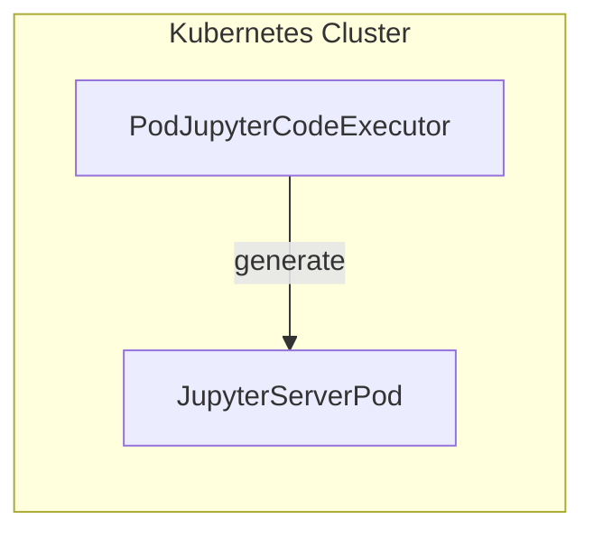

# autogen-kubernete-mcp

autogen-kubernetes-mcp is an MCP(Model Context Protocol) server that acts as a Python code interpreter fully compatible with the python built-in tool of the gpt-oss model.

It is designed as a custom extension for autogen-kubernetes, enabling Python code execution inside a Kubernetes Pod with configurable runtime parameters.

This MCP server can be used in environments where code execution needs to be isolated, reproducible, and integrated with Kubernetes workloads.

## Installation & Usage

1. Install via `pip`

```bash
pip install autogen-kubernetes-mcp
```

2. Install via `uv`

```bash
uv pip install autogen-kubernetes-mcp
```

3. Run via `uvx`

```bash
uvx autogen-kubernetes-mcp commandline --namespace my-namespace --image python:3.11-slim
```

4. Run via Python module

```bash
python -m autogen_kubernetes_mcp commandline --namespace my-namespace --image python:3.11-slim
```

## Command-line Arguments

Command-line arguments are used when creating `PodCommandLineCodeExecutor`/`PodJupyterCodeExecutor` and MCP server.

`type` arguments: jupyter type creates `PodJupyterCodeExecutor` for python code executor tool.

MCP server have to run in same kubernetes cluster because `PodJupyterCodeExecutor` only uses service FQDN to connect jupyter server.

Not validated for non-text outputs yet.



All the arguments are optional

|Argument|Description|Default|
|--|--|--|
|`type`|Code Executor type, commandline(stateless), jupyter(stateful) supported||
|`--host`|MCP server host address|`0.0.0.0`|
|`--port`|MCP server port|`8000`|
|`--kubeconfig`|Path to the kubeconfig file|`None`(auto-detected)|
|`--image`|Pod container image name|`None`|
|`--pod-name`|Pod name|(auto-generated)|
|`--timeout`|Code execution timeout(seconds)|`60`|
|`--workspace-path`|Path inside the container where scripts are stored|`/workspace`|
|`--namespace`, `-n`|Kubernetes namespace for Pod creation|`default`|
|`--volume`|Kubernetes volume to mount into the Pod/container, accepts YAML format string, YAML file path|`None`|
|`--pod-spec`|Custom Pod spec definition(YAML format string, YAML file path)|`None`|
|`--command`|Custom executor container command|`None`|
|`--args`|Custom executor container arguments|`None`|

## License

This project is licensed under the MIT License.
